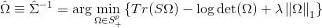
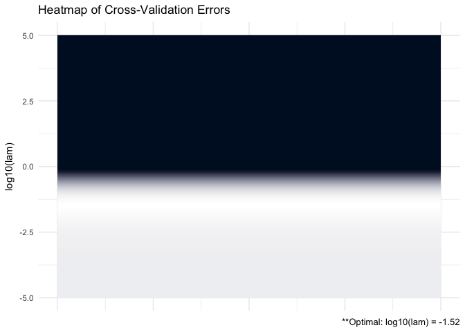
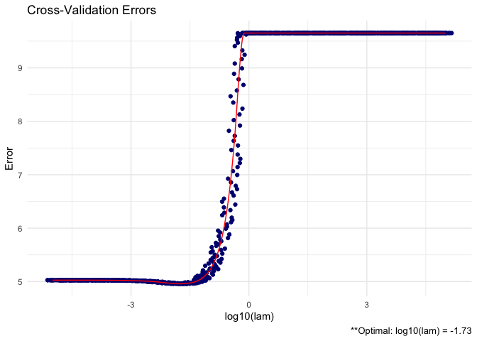

GLASSOO
================

See [manual](https://github.com/MGallow/GLASSO/blob/master/GLASSO.pdf).

Overview
--------

<br>

<p align="center">

</p>
<br>

`GLASSO` is an R package that estimates a penalized precision matrix via block-wise coordinate descent -- also known as the graphical lasso (glasso) algorithm. A (possibly incomplete) list of functions contained in the package can be found below:

-   `GLASSO()` computes the estimated precision matrix

-   `plot.GLASSO()` produces a heat map or line graph for cross validation errors

Installation
------------

``` r
# The easiest way to install is from GitHub:
# install.packages("devtools")
devtools::install_github("MGallow/GLASSOO")
```

If there are any issues/bugs, please let me know: [github](https://github.com/MGallow/GLASSOO/issues). You can also contact me via my [website](http://users.stat.umn.edu/~gall0441/). Pull requests are welcome!

Usage
-----

``` r
library(GLASSOO)

# generate data from a sparse matrix
# first compute covariance matrix
S = matrix(0.7, nrow = 5, ncol = 5)
for (i in 1:5){
  for (j in 1:5){
    S[i, j] = S[i, j]^abs(i - j)
  }
}

# print oracle precision matrix (shrinkage might be useful)
(Omega = qr.solve(S) %>% round(3))
```

    ##        [,1]   [,2]   [,3]   [,4]   [,5]
    ## [1,]  1.961 -1.373  0.000  0.000  0.000
    ## [2,] -1.373  2.922 -1.373  0.000  0.000
    ## [3,]  0.000 -1.373  2.922 -1.373  0.000
    ## [4,]  0.000  0.000 -1.373  2.922 -1.373
    ## [5,]  0.000  0.000  0.000 -1.373  1.961

``` r
# generate 1000 x 5 matrix with rows drawn from iid N_p(0, S)
Z = matrix(rnorm(100*5), nrow = 100, ncol = 5)
out = eigen(S, symmetric = TRUE)
S.sqrt = out$vectors %*% diag(out$values^0.5) %*% t(out$vectors)
X = Z %*% S.sqrt

# calculate sample covariance
Sample = (nrow(X) - 1)/nrow(X)*cov(X)

# print sample precision matrix (perhaps a bad estimate)
(qr.solve(cov(X)) %>% round(5))
```

    ##          [,1]     [,2]     [,3]     [,4]     [,5]
    ## [1,]  2.10163 -1.56504  0.14953  0.02062  0.01857
    ## [2,] -1.56504  3.18650 -1.25450 -0.23707 -0.04071
    ## [3,]  0.14953 -1.25450  2.48906 -1.29051  0.14033
    ## [4,]  0.02062 -0.23707 -1.29051  2.85862 -1.38010
    ## [5,]  0.01857 -0.04071  0.14033 -1.38010  1.96014

``` r
# GLASSO (lam = 10^(-1))
GLASSO(S = Sample, lam = 10^(-1))
```

    ## 
    ## Call: GLASSO(S = Sample, lam = 10^(-1))
    ## 
    ## Iterations:
    ## [1] 7
    ## 
    ## Tuning parameter:
    ##       log10(lam)  lam
    ## [1,]          -1  0.1
    ## 
    ## Log-likelihood: -8.12889
    ## 
    ## Omega:
    ##          [,1]     [,2]     [,3]     [,4]     [,5]
    ## [1,]  1.66353 -0.96350  0.00000  0.00000  0.00000
    ## [2,] -0.96350  2.20755 -0.78538 -0.22550  0.00000
    ## [3,]  0.00000 -0.78538  1.84533 -0.83353  0.00000
    ## [4,]  0.00000 -0.22550 -0.83353  2.04501 -0.90442
    ## [5,]  0.00000  0.00000  0.00000 -0.90442  1.58640

``` r
# GLASSO cross validation
GLASSO(X, lam = 10^seq(-5, 5, 0.5))
```

    ## 
    ## Call: GLASSO(X = X, lam = 10^seq(-5, 5, 0.5))
    ## 
    ## Iterations:
    ## [1] 7
    ## 
    ## Tuning parameter:
    ##       log10(lam)   lam
    ## [1,]          -2  0.01
    ## 
    ## Log-likelihood: -123.18936
    ## 
    ## Omega:
    ##          [,1]     [,2]     [,3]     [,4]     [,5]
    ## [1,]  2.05022 -1.43321  0.07446  0.00296  0.00270
    ## [2,] -1.43321  2.99367 -1.15595 -0.24757  0.00000
    ## [3,]  0.07446 -1.15595  2.41010 -1.18025  0.03513
    ## [4,]  0.00296 -0.24757 -1.18025  2.70643 -1.27714
    ## [5,]  0.00270  0.00000  0.03513 -1.27714  1.92206

``` r
# produce CV heat map for GLASSO
GLASSO = GLASSO(X, lam = 10^seq(-5, 5, 0.01))
GLASSO %>% plot
```



``` r
# produce line graph for CV errors for GLASSO
GLASSO %>% plot(type = "line")
```


