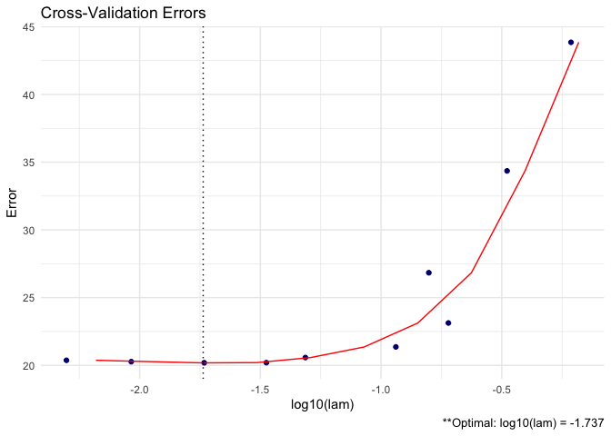

GLASSOO
================

See [manual](https://github.com/MGallow/GLASSO/blob/master/GLASSOO.pdf).

Overview
--------

<br>

<p align="center">

</p>
<br>

`GLASSO` is an R package that estimates a penalized precision matrix via block-wise coordinate descent -- also known as the graphical lasso (glasso) algorithm. A (possibly incomplete) list of functions contained in the package can be found below:

-   `GLASSO()` computes the estimated precision matrix

-   `plot.GLASSO()` produces a heat map or line graph for cross validation errors

Installation
------------

``` r
# The easiest way to install is from GitHub:
# install.packages("devtools")
devtools::install_github("MGallow/GLASSOO")
```

If there are any issues/bugs, please let me know: [github](https://github.com/MGallow/GLASSOO/issues). You can also contact me via my [website](http://users.stat.umn.edu/~gall0441/). Pull requests are welcome!

Usage
-----

``` r
library(GLASSOO)

# generate data from a sparse matrix
# first compute covariance matrix
S = matrix(0.7, nrow = 5, ncol = 5)
for (i in 1:5){
  for (j in 1:5){
    S[i, j] = S[i, j]^abs(i - j)
  }
}

# print oracle precision matrix (shrinkage might be useful)
(Omega = qr.solve(S) %>% round(3))
```

    ##        [,1]   [,2]   [,3]   [,4]   [,5]
    ## [1,]  1.961 -1.373  0.000  0.000  0.000
    ## [2,] -1.373  2.922 -1.373  0.000  0.000
    ## [3,]  0.000 -1.373  2.922 -1.373  0.000
    ## [4,]  0.000  0.000 -1.373  2.922 -1.373
    ## [5,]  0.000  0.000  0.000 -1.373  1.961

``` r
# generate 1000 x 5 matrix with rows drawn from iid N_p(0, S)
Z = matrix(rnorm(100*5), nrow = 100, ncol = 5)
out = eigen(S, symmetric = TRUE)
S.sqrt = out$vectors %*% diag(out$values^0.5) %*% t(out$vectors)
X = Z %*% S.sqrt

# calculate sample covariance
Sample = (nrow(X) - 1)/nrow(X)*cov(X)

# print sample precision matrix (perhaps a bad estimate)
(qr.solve(cov(X)) %>% round(5))
```

    ##          [,1]     [,2]     [,3]     [,4]     [,5]
    ## [1,]  1.77452 -1.52421  0.00896  0.25383  0.01418
    ## [2,] -1.52421  3.46629 -1.41101 -0.08099 -0.31840
    ## [3,]  0.00896 -1.41101  2.79597 -1.11710  0.17526
    ## [4,]  0.25383 -0.08099 -1.11710  2.77327 -1.75156
    ## [5,]  0.01418 -0.31840  0.17526 -1.75156  2.73721

``` r
# GLASSO (lam = 0.5)
GLASSO(S = Sample, lam = 0.5)
```

    ## 
    ## Call: GLASSO(S = Sample, lam = 0.5)
    ## 
    ## Iterations:
    ## [1] 3
    ## 
    ## Tuning parameter:
    ##       log10(lam)  lam
    ## [1,]      -0.301  0.5
    ## 
    ## Log-likelihood: -10.89827
    ## 
    ## Omega:
    ##          [,1]     [,2]     [,3]     [,4]     [,5]
    ## [1,]  0.93879 -0.17857  0.00000  0.00000  0.00000
    ## [2,] -0.17857  1.23551 -0.07325  0.00000  0.00000
    ## [3,]  0.00000 -0.07325  1.22391 -0.04095  0.00000
    ## [4,]  0.00000  0.00000 -0.04095  1.06546 -0.16866
    ## [5,]  0.00000  0.00000  0.00000 -0.16866  1.32332

``` r
# GLASSO cross validation
GLASSO(X)
```

    ## 
    ## Call: GLASSO(X = X)
    ## 
    ## Iterations:
    ## [1] 3
    ## 
    ## Tuning parameter:
    ##       log10(lam)    lam
    ## [1,]      -1.737  0.018
    ## 
    ## Log-likelihood: -108.65963
    ## 
    ## Omega:
    ##          [,1]     [,2]     [,3]     [,4]     [,5]
    ## [1,]  1.67594 -1.35403  0.00000  0.16188  0.00000
    ## [2,] -1.35403  3.15010 -1.27590 -0.08024 -0.20431
    ## [3,]  0.00000 -1.27590  2.63011 -0.93647  0.00000
    ## [4,]  0.16188 -0.08024 -0.93647  2.51894 -1.55285
    ## [5,]  0.00000 -0.20431  0.00000 -1.55285  2.58649

``` r
# produce CV heat map for GLASSO
GLASSO = GLASSO(X)
GLASSO %>% plot
```



``` r
# produce line graph for CV errors for GLASSO
GLASSO %>% plot(type = "heatmap")
```


